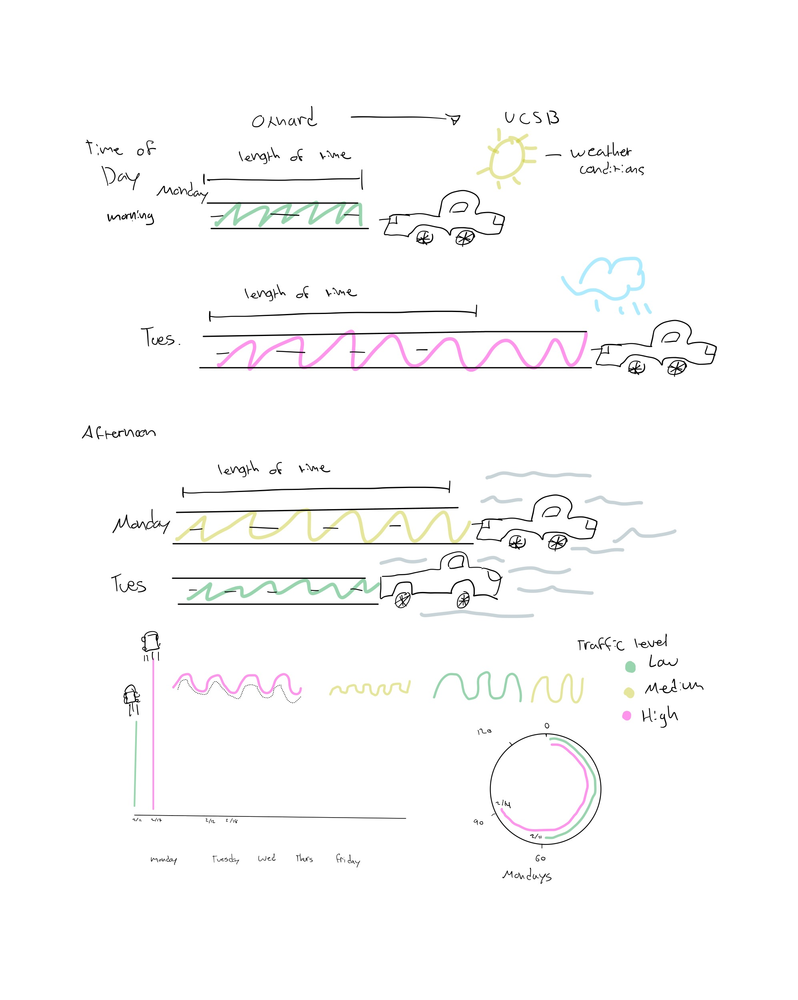

[GitHub Repository](https://github.com/yaasiell/ENVS-193DS_homework-03.git)

```{r}
#| label: Read in Packages and Data
#| message: false
#| warning: false
# Loading in required packages
library (tidyverse) # data wrangling and plotting
library(here) # direct file paths to call from
library(janitor) # to examine and read in data
library(readxl) # reads excel files

# create new object called salinity to call from our data file
salinity <- read.csv(here("data",
                     "salinity-pickleweed.csv")) 
# my_data_commute as new object for my logged commute data
my_data_commute <- read.csv(here("data","updated_commute.csv")) |>
clean_names() # cleans column names to be used in ggplot

# my_data_skateboard as new object for my logged skateboard
my_data_skateboard <- read.csv(here("data","updated_skateboard.csv")) |>
  clean_names() # cleans skateboard data columns to correct format
```

# Problem 1. Slough soil salinity

## a. An appropriate test

\[The appropriate tests to determine the strength of the relationship between salinity and California pickle weed biomass would be the Pearson's correlation and Spearman's rank correlation. Pearson's correlation differs because it is used when two continuous variables have a linear relationship and are normally distributed with the data meeting its assumptions of normality and independence. Spearman's correlations is different because it is non-parametric and based on ranks that is more helpful in a monotonic relationship between variables instead of a linear relationship. \]

## b. Create a visualization

```{r}
#| label: Creating a visualization for relationship between salinity and pickleweed biomass
# create a visualization for the relationship between salinity and pickleweed mass
ggplot(data = salinity, # calls for salinity data set
       aes(x = salinity_mS_cm, # calls for assigning salinity column data to x-axis
           y = pickleweed # calls for assigning pickle weed column data to y-axis
           )) +
  geom_point(color = "dodgerblue3", # plot data as points and change color
             size = 3) + # change the size for each data point
  labs(x = "Soil Salinity (mS/cm)", # call for labels and names x-axis with measurements
       y = "Pickelweed biomass (g)", # label for y-axis with measurements
       #label for title of the graph
       title = "Relationship between Pickleweed biomass and Soil Salinity" 
  ) +
  theme_get() # changes theme different from the default 

```

## c. Check your assumptions and run your test

### Checking Assumptions

```{r}
#| label: Plot to check salinity assumptions
# Histogram of soil salinity distribution
ggplot(data =salinity, # calls for salinity data set
       aes(x = salinity_mS_cm,)) + # assigns salinity data column to x-axis
  geom_histogram(fill = "lightpink1", # calls for data as histogram using "fill()" to color them
                 color = "hotpink1", # colors the outline of the histogram boxes
                 bins = 8) + # groups data into bins of 8 data points 
  labs(x = "Soil Salinity (mS/cm)", # calls for labels and x-axis title
       y = "Count", # y-axis title
       title = "Soil Salinity Histogram Distribution") + # title of the graph
  theme_classic()
```

```{r}
#| label: Plot to check pickleweed distribution
# Histogram to check distribution of pickleweed data
ggplot(data = salinity, # calls for salinity data set
       aes(x = pickleweed, # assigns data from pickleweed to x-axis
           )) +
  geom_histogram(fill = "darkgreen", # assigns data points into a histogram and colors them 
                 color = "green4", # color for the histogram outline
                 bins = 8) + # assigns data into bins 
  labs(x = "Pickleweed biomass (g)", # label for x-axis
       y = "Count", # label for y-axis graph
       # label for the title of the histogram
       title = "Pickleweed biomass Histogram Distribution ") +
  theme_classic() # changes the theme to a classic look
```

\[For this section I checked the assumptions of normal distribution and a linear relationship. I checked these assumptions by creating histograms and scatter plots to see if there was a linear relationship between salinity variables and if the data was normally distributed through a histogram. The scatter plot does shows that there could be a linear relationship between soil salinity and biomass, and the histogram shows that the distribution is normal by having an overall bell shape with no extreme variation making Person's correlation the best test. \]

### Running Test

```{r}
#| label: Pearson correlation Test
# Pearson Correlation Test to evaluate strength of linear 
# relationship of salinity and pickleweed biomass
# cor.test() calls for test for association between paired samples
cor.test(
  # dataset$variable 
  salinity$salinity_mS_cm, salinity$pickleweed,
         method = "pearson") # specifies to use Pearson correlation
```

## d. Results communication

\[To evaluate the strength of the relationship between pickleweed biomass and soil salinity, I used a Pearson correlation test. The test was used because both pickleweed biomass (g) and soil salinity (mS/cm) are continuous variables and can test the strength of the linear relationship of both uisng this test. The test showed a moderate relationship between soil salinity and biomass (Pearson's r = 0.53, t(21) = 2.9, p =0.01, $\alpha = 0.05$). This data would suggest that pickleweed biomass would tend to increase as soil salinity increases suggesting that higher salinity could support more growth in pickleweed plants. \]

## e. Test implications

\[The results suggest that pickleweed biomass increases as soil salinity increases. For restoration planting, these results shows that pickleweed may grow more successfully in areas with higher salinity along the slough. To maximize planting success, the restoration site efforts should focus on prioritizing planting pickleweed in locations with higher salinity. \]

## f. Double check your own work

```{r}
#| label: Spearmans Rank Correlation Test
# Spearmans Rank Correlation Test
# run a non-parametric correlation test measuring strenght of 
# monotonic relationship of ranked data
cor.test( # "cor.test()" calls for test association between two variables
  salinity$salinity_mS_cm,  # "data set$variable"
  salinity$pickleweed,  # "data set$variable"
  method = "spearman" # specifically calls for Spearman test to be ran.
)
```

\[I ran a Spearmans Rank correlation test as non-paramtetric rank alternative compared to Pearsons correlation that evaluated the relationsip between pickleweed mass and soil salinity and showed a moderate relationship (Spearman $\rho = 0.59$, S = 824, p = 0.01, $\alpha = 0.05$) which was similar to the Pearson correlation results (Pearson's r = 0.53, t(21) = 2.9, p =0.01, $\alpha = 0.05$). Both tests would lead to the same decision about the null hypothesis that there is no relationship between both variables and shows the relationship that as pickleweed biomass increases as soil salinity increases. \]

# Problem 2. Personal Data

## a. Updating your visualizations

```{r}
#| label: Updated commute data visualization
# Visualizing Updated commute data visualization
ggplot(data = my_data_commute, # calls for commute data frame
       aes(x = day_of_week, # assigns day of week column to x-axis
           y = commute_time_minutes, # assigns commute time to y-axis
           color = time_of_day)) + # changes color depending on time of day
  geom_point(size = 3) + # changes size of data points
  facet_wrap(~ time_of_day) + # add legend for specific column
  # labels for title
  labs(title = "Commute Time Across Days of the Week: Afternoon vs. Morning",
       x = "Day of the Week", # labels x-axis
       y = "Commute Time (minutes)", # labels y-axis
       color = "Time of Day") + # assings legends based on colored points
  theme_minimal() # changes theme 

```

```{r}
#| label: updated skateboard data visualization
# Visualizing updated skateboard data
my_data_skateboard_m <- my_data_skateboard |>
  clean_names() |>
  mutate(day_of_week = str_trim(day_of_week), # removes extra spaces from weekday names
    day_of_week = factor(day_of_week, # changes day_of_week into an ordered factor
      levels = c("Monday", "Tuesday", "Wednesday", "Thursday", "Friday")))
ggplot(data = my_data_skateboard_m,
       aes(x = day_of_week, # assigns x-axis to weekday
           y = skate_time_minutes, # assigns y-axis to skateboard time
           color = day_of_week)) + # colors points and boxplots by weekday
  geom_boxplot() +
  geom_jitter(width = 0.15, # spreads points horizontally
              height = 0, # keeps points at y value
              alpha = 0.6, # makes points slightly transparent
              size = 3) + # changes point size
  scale_color_manual( # assign a unique color to each day value
    values = c("Monday" = "green4", # assigning colors to values
               "Tuesday" = "pink3",
               "Wednesday" = "purple4",
               "Thursday" = "blue2",
               "Friday" = "goldenrod3")
  ) +
  labs( # calls for labels on graph
    title = "Skate Time Across Days of the Week", # adds plot title
    x = "Day of the Week", # labels x-axis
    y = "Skate Time (minutes)", # labels y-axis with units
    color = "Day of the Week" # labels legend
  ) +
  theme_classic() # uses a cleaner theme with less visual clutter
```

## b. Captions

\[Figure 1. Commute Plot: Shows commute time from Oxnard to UCSB across the days of the week separated by the time of day (morning vs. afternoon). Morning commutes ranged from 60-90 minutes while the afternoon commutes varied more with one longer commute. This figure highlights how commute times could vary depending on both the day of the week and morning or afternoon departure time.

Figure 2. Skateboard Plot: Shows skateboard commute time (minutes) across campus across weekdays. Each point is represented by an individual observation and each day has its own boxplot to represent the overall distribution of skate time between weekday. Skate time would vary greatly based on the day with a tighter cluster of points on friday and a larger spread of points on Monday. Wednesday being the most time skated of all weekdays.\]

# Problem 3. Affective visualization

## a. Describe in words what an affective visualization could look like for your personal data
[An affective visualization that I would be interested in for my personal data would be to do a digital art work that I would create by hand based on the different variables I was able to record for my commute data. I wanted to blend a bit of the "Dear Data" website minimalist hand drawn art work by representing shapes as data points and colors as categorical variables trying to blend in as much as the variables I could organize neatly into my artwork.I also really liked the Environmental graphiti on how they blended a few different colors to hopefully make it more abstract as well. I hope to represent colors of what the weather conditions were like for the data points such as using a yellow-orange blend for sunny conditions and a gray color blend for cloudy conditions.
]
## b. Create a sketch (on paper) of your idea


## c. Make a draft of your visualization.


## d. Write an artist statement

## e. Prep your materials to share to class.

# Problem 4. Statistical critique

## a. Revisit and summarize

## b. Visual clarity

## c. Aesthetic clarity

## d. Recommendations
